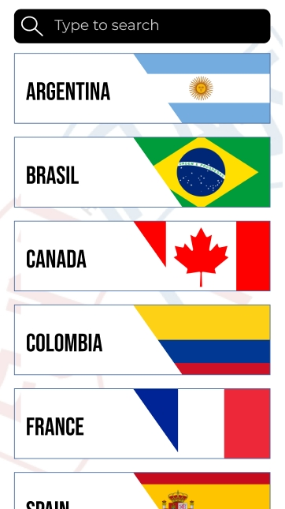
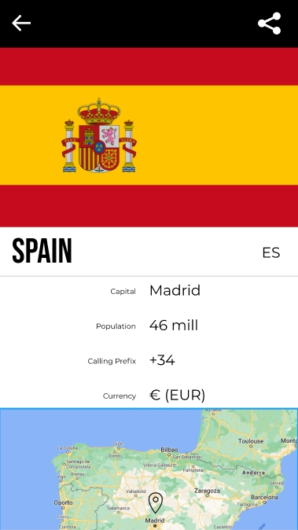

# **Fun With Flags App**

*This is a demonstration **Android** app to get information from the [RestCountries API](https://restcountries.eu/#rest-countries) and display details of each nation of the  world in a beautiful and easy way.*

## Wiremocks

`Splash`, `List` and `Details` view.

## Architecture

The app makes use of the **Architecture Components**  of the [Android Jetpack](https://developer.android.com/jetpack/) libraries. The design is based in **MVVM Pattern** and **reactive programming**.

With this architecture strongly guarantees [SEC](https://developer.android.com/jetpack/guide#separation-of-concerns) and using [DI](https://en.wikipedia.org/wiki/Dependency_injection) the integration of different parts is easier and clean.

To persist data the [Room](https://developer.android.com/jetpack/androidx/releases/room) library is implemented, giving the app cohesion and stability.

With **Data Binding** and **View Binding** the codebase follows the [SRP](https://en.wikipedia.org/wiki/Single_responsibility_principle) as the views are only responsible of visualization while the data transformations and business logic runs in the **View Models**.

For the UI a simple approach was conceived using **Material Design** based components and basic animations and transitions.

## Tasks

- [ ] Config resources and gradle files.
- [ ] Setting fragments and viewmodel.
- [ ] Prepare Bindings and Navigation.
- [ ] Setup API client.
- [ ] Handle data from API.
- [ ] Improve performance.
- [ ] Internationalization.

## Extras

- [ ] Filters.
- [ ] LTR Languages.
- [ ] Animations.
- [ ] Splash.
- [ ] Google Map.
- [ ] UI tests.

* UnitTests implemented on demand for each task.